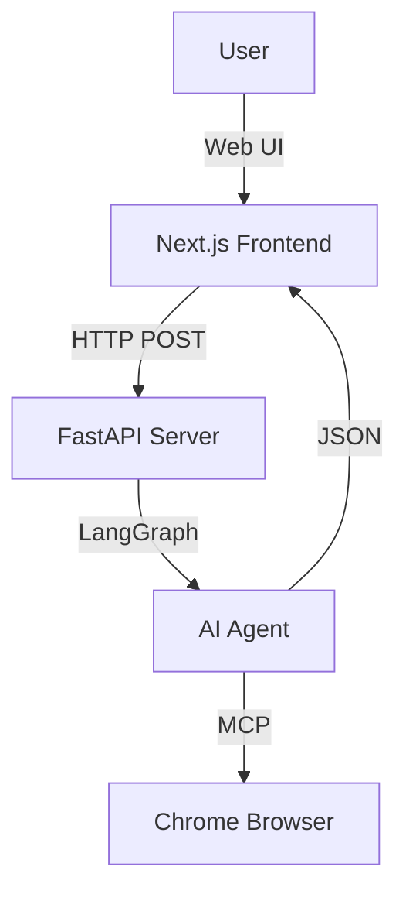

# Architecture Overview

This project implements a Model Context Protocol (MCP) server for automating interactions with Xiaohongshu (XHS). It supports two distinct architectural approaches:

## 1. Headless Go Server (Legacy/Backend)
*   **Core**: Written in Go (`cmd/server`).
*   **Automation**: Uses `playwright-go` to launch a browser instance controlled programmatically.
*   **Auth**: Relies on `cmd/get_cookies` to harvest session data (`auth.json`) which is then injected into the headless browser.
*   **Pros**: Fully automated, runs on servers.
*   **Cons**: Hard to bypass XHS anti-bot protections (CAPTCHA, slide verification).

## 2. Chrome Extension Bridge (Active/Human-in-the-Loop)
*   **Core**: Uses the `mcp-chrome` project (Node.js bridge + Browser Extension).
*   **Automation**: Controls the **user's actual browser** (Edge/Chrome) via the Native Messaging Host protocol.
*   **Auth**: Uses the user's existing logged-in session. No need to harvest cookies manually.
*   **Agent**: A Python script (`agent_chrome.py`) connects to the Node.js bridge via Stdio or SSE to send commands.
*   **Pros**: Bypasses most anti-bot checks because it uses a real, human-operated browser.
*   **Cons**: Requires a desktop environment and an open browser window.

## 3. Full-Stack Agent (Next.js + FastAPI)
*   **Frontend**: `sns-agent` (Next.js 16) provides a visual interface for content creation and chat.
*   **Backend**: `agent_server.py` (FastAPI) wraps the LangGraph agent.
*   **Communication**: The frontend sends JSON requests to the backend. The backend uses the `modify_canvas` tool to send updates back to the frontend.
*   **Mode**: Runs in "Auto-Pilot" mode (no interrupts) to serve API requests efficiently.

## Component Diagram (Full Stack)



## Component Diagram (Chrome Bridge)

```mermaid
graph TD
    User[User] -->|Starts| Agent[Python Agent (agent_chrome.py)]
    Agent -->|Stdio/SSE| Bridge[Node.js Bridge (mcp-server-stdio.js)]
    Bridge -->|Native Messaging| Browser[Edge Browser]
    Browser -->|Extension| XHS[Xiaohongshu Website]
```
